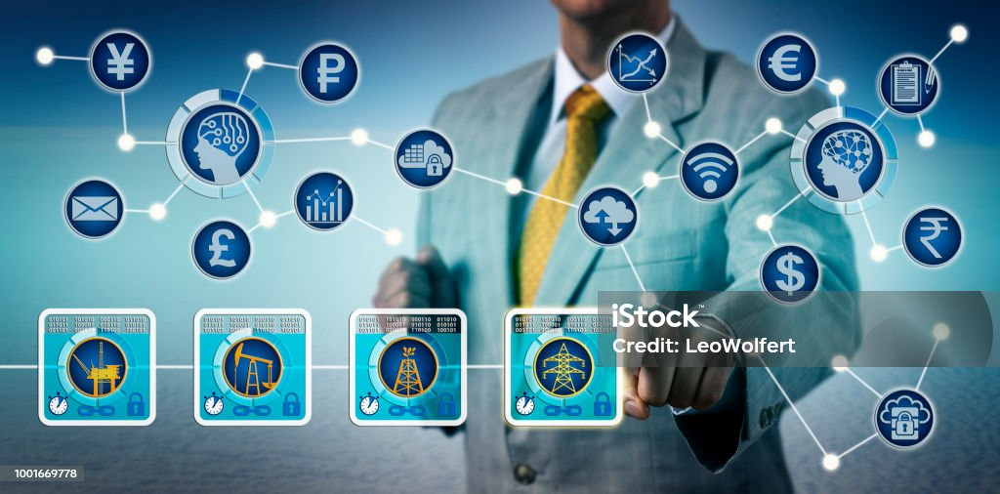

# 💻 El sector productivo vinculado a la familia profesional de la informática y las comunicaciones

## 🌱 Introducción

El sector de la informática y las telecomunicaciones es clave para la transformación digital y la sostenibilidad. La innovación en tecnología permite **reducir el impacto ambiental**, optimizar recursos y mejorar la eficiencia energética.

## 🔹 Características principales

- 📡 **Alta conectividad global**: Permite la interconexión de dispositivos, personas y empresas en todo el mundo, facilitando el acceso a la información y la comunicación instantánea.
- ⚙️ **Automatización y digitalización**: Mejora la eficiencia en los procesos productivos, reduciendo costos y tiempos de operación mediante el uso de inteligencia artificial y tecnologías avanzadas.
- 🖥️ **Desarrollo de software y hardware sostenible**: Fomenta la creación de productos tecnológicos eficientes en consumo energético y fabricados con materiales reciclables.
- 🌍 **Impulso de la economía circular a través del reciclaje de dispositivos**: Minimiza el impacto ambiental promoviendo la reutilización y el reciclaje de equipos electrónicos.

Este sector desempeña un papel crucial en la consecución de los Objetivos de Desarrollo Sostenible (ODS), ayudando a reducir la huella de carbono y promoviendo la eficiencia energética.

[🔙 Volver al índice](../indice_pisa3_1_DelOlmo.md)
[⏭️ Ir a la página siguiente](./1.2_ods_relevantes_DelOlmo.md)
