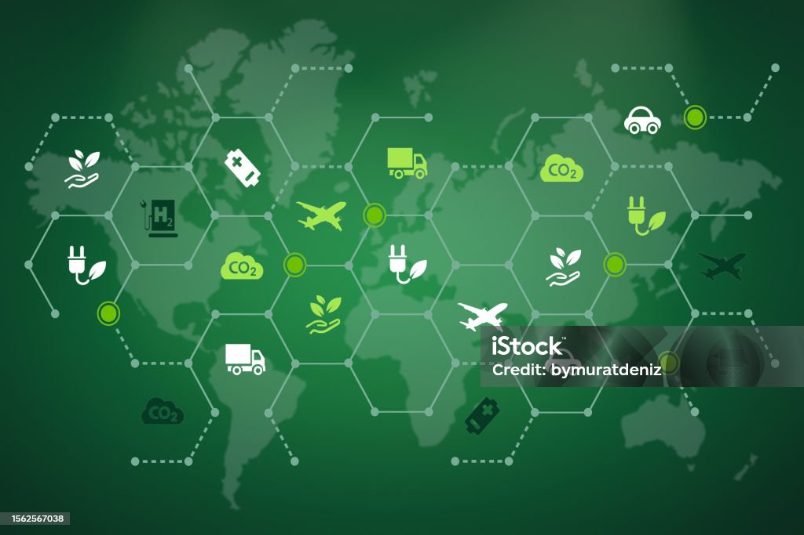

# 🌍 Identificación de los aspectos de sostenibilidad y ODS más relevantes en cada sector productivo

## 📌 Introducción

La sostenibilidad es un eje clave en el desarrollo de cualquier sector productivo. La implementación de los **Objetivos de Desarrollo Sostenible (ODS)** de la ONU permite orientar las estrategias económicas, sociales y ambientales hacia un futuro más responsable y equitativo.

## 🔍 Sectores productivos y ODS relevantes

Los sectores productivos que analizaremos junto con sus ODS clave son:

- 🏪 **Comercio y distribución**
  - 📦 **ODS 12**: Producción y consumo responsables
  - 🚛 **ODS 13**: Acción por el clima (reducción de emisiones en transporte)

- 🏗️ **Construcción e ingeniería civil**
  - 🏢 **ODS 11**: Ciudades y comunidades sostenibles
  - ⚒️ **ODS 9**: Industria, innovación e infraestructura

- 🌾 **Sector agroalimentario**
  - 🌱 **ODS 2**: Hambre cero (producción sostenible de alimentos)
  - 🚜 **ODS 15**: Vida de ecosistemas terrestres

- 💊 **Farmacéutico y sanitario**
  - 🏥 **ODS 3**: Salud y bienestar
  - 🌡️ **ODS 9**: Innovación en salud y producción responsable de medicamentos

- 🏭 **Sector industrial**
  - ⚙️ **ODS 9**: Industria, innovación e infraestructura
  - 🌍 **ODS 13**: Acción por el clima (reducción de emisiones y eficiencia energética)

- 💰 **Servicios financieros de banca y seguros**
  - 💲 **ODS 8**: Trabajo decente y crecimiento económico
  - 📉 **ODS 10**: Reducción de desigualdades (inclusión financiera)

- 👨‍💼 **Servicios profesionales**
  - 🏢 **ODS 8**: Trabajo decente y crecimiento económico
  - 🔄 **ODS 12**: Producción y consumo responsables

- 📡 **Telecomunicaciones y nuevas tecnologías**
  - 📶 **ODS 9**: Industria, innovación e infraestructura
  - 🖥️ **ODS 4**: Educación de calidad (acceso a tecnología educativa)

- ✈️ **Turismo**
  - 🌍 **ODS 8**: Turismo sostenible y crecimiento económico
  - 🏖️ **ODS 14**: Vida submarina (reducción del impacto del turismo en ecosistemas marinos)

- ⚡ **Utilidades y energía**
  - 🔋 **ODS 7**: Energía asequible y no contaminante
  - 🔄 **ODS 12**: Producción y consumo responsables

- 🎓 **Sector educativo y cultural**
  - 📚 **ODS 4**: Educación de calidad
  - 🌏 **ODS 16**: Paz, justicia e instituciones sólidas

- 🏛️ **Sector público y administraciones**
  - ⚖️ **ODS 16**: Paz, justicia e instituciones sólidas
  - 🔄 **ODS 17**: Alianzas para lograr los objetivos

Cada uno de estos sectores juega un papel fundamental en la implementación de medidas de sostenibilidad y el cumplimiento de los ODS.

[🔙 Volver al índice](../indice_pisa3_1_DelOlmo.md)
[⏭️ Ir a la página siguiente](./1.1_sector_productivo_DelOlmo.md)
