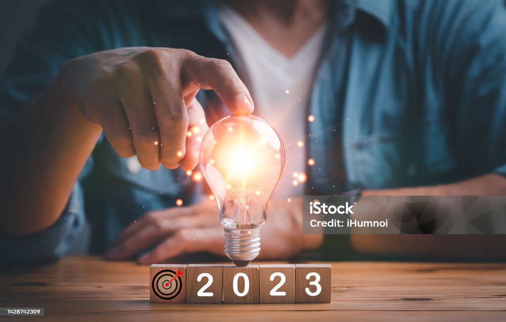

# 🌟 Oportunidades de mejora e innovación sostenible

## 💡 Introducción

A pesar de los riesgos identificados, el sector de la informática y telecomunicaciones tiene **grandes oportunidades** para innovar y mejorar su impacto en la sostenibilidad. La implementación de modelos más eficientes y ecológicos permitirá avanzar en el cumplimiento de los **ODS**.

## 🚀 Principales oportunidades

- **🔄 Economía circular**: Extender la vida útil de los dispositivos electrónicos y fomentar el reciclaje.
- **🔋 Energía renovable**: Integración de fuentes de energía limpia en centros de datos.
- **📡 Digitalización sostenible**: Implementación de tecnologías que reduzcan el consumo energético y optimicen los procesos.
- **🌱 Sensibilización ambiental**: Promover buenas prácticas en el uso de dispositivos tecnológicos.

## 🔄 Integración de la economía circular como ventaja competitiva

### 🌱 ¿Qué es la economía circular?

La **economía circular** es un modelo de producción y consumo que busca **reducir, reutilizar y reciclar** los recursos para minimizar el impacto ambiental. En el sector de la informática y telecomunicaciones, este enfoque permite mejorar la sostenibilidad y reducir costos.

### 🏆 Beneficios clave en el sector tecnológico

- 💻 **Diseño modular**: Facilita la reparación y actualización de hardware, reduciendo la obsolescencia.
- 🔄 **Reutilización de materiales**: Reciclaje de componentes electrónicos para fabricar nuevos dispositivos.
- 🌍 **Reducción de residuos electrónicos**: Disminución del impacto ambiental generado por los desechos tecnológicos.
- 💰 **Ahorro económico**: Menores costos de producción mediante el aprovechamiento de materiales reciclados.

## 📡 Digitalización y tecnologías para mitigar impactos negativos

### 💻 Digitalización para la sostenibilidad

La digitalización es un motor clave para la sostenibilidad. A través del uso eficiente de la tecnología, se pueden reducir **residuos, emisiones de carbono y consumo energético** en múltiples sectores.

### 🚀 Tecnologías clave para la sostenibilidad

#### 🌍 **Computación en la nube**

- Optimización del uso de servidores, reduciendo el consumo de energía.
- Disminución del hardware físico necesario mediante almacenamiento virtual.

#### 🔋 **Eficiencia energética en data centers**

- Uso de **energía renovable** en centros de procesamiento de datos.
- Implementación de **sistemas de enfriamiento avanzados** para reducir el consumo energético.

#### ♻️ **Internet de las Cosas (IoT)**

- Monitorización del consumo energético en tiempo real para optimizar su uso.
- Aplicación de IoT en ciudades inteligentes para mejorar la eficiencia de los recursos.

#### 🖥️ **Inteligencia Artificial y Big Data**

- Predicción de patrones de consumo para evitar desperdicio de recursos.
- Optimización de redes eléctricas para reducir la huella de carbono.

La combinación de estas tecnologías ayuda a mitigar el impacto ambiental y mejora la eficiencia en diversos sectores.

[🔙 Volver al índice](../indice_pisa3_1_DelOlmo.md)
[⏭️ Ir a la página siguiente](.md)
